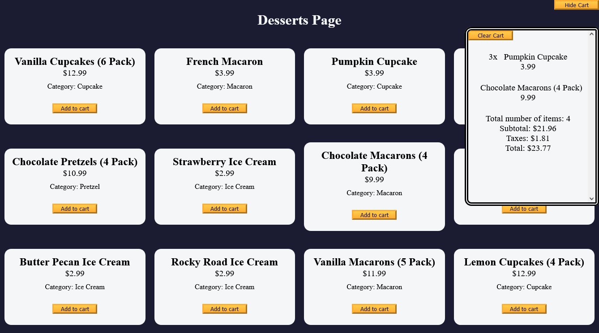

# Shopping Cart Project from freeCodeCamp

This is a project from freeCodeCamp's JavaScript Algorithms and Data Structures course. I wanted to create a repo for it for future reference and understand how to implement OOP principles better by writing it myself.

### Screenshot

### Links

- [View Code](https://github.com/elizerdim/fcc-shopping-cart)
- [Live Preview](https://elizerdim.github.io/fcc-shopping-cart/)

### Built with

- HTML
- CSS 
- JavaScript
- OOP design pattern

### Useful resources

- [Function.prototype.bind()](https://developer.mozilla.org/en-US/docs/Web/JavaScript/Reference/Global_Objects/Function/bind)